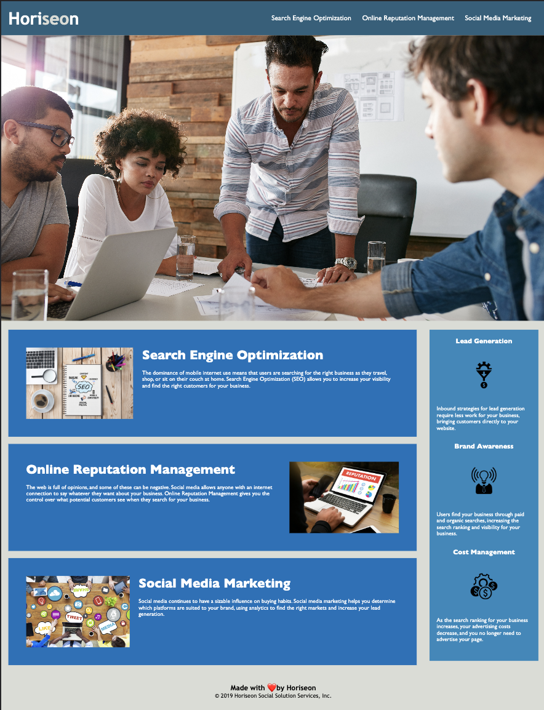

# Code Refactor 

## Technology Used 

| Technology Used         | Resource URL           | 
| ------------- |:-------------:| 
| HTML    | [https://developer.mozilla.org/en-US/docs/Web/HTML](https://developer.mozilla.org/en-US/docs/Web/HTML) | 
| CSS     | [https://developer.mozilla.org/en-US/docs/Web/CSS](https://developer.mozilla.org/en-US/docs/Web/CSS)      |   
| Git | [https://git-scm.com/](https://git-scm.com/)     |    

## Description 

[Visit the Deployed Site](https://famelga.github.io/code-refactor-site/)

The client Horiseon, is looking to update their website to be more accessible. 

A screen reader is a common accessability tool used when searching the web. Having clearly marked tags allows for screen readers to more accurately identify the information that is on the page for the person using the tool. For this reason, I have replaced each div tag in the html file with the corresponding semantic element, which give meaning to the tags. To make the website visually accessible and readable, I increased the font size from 16px to 20px for the paragraphs.

Another html feature that can impact accessibility is the use of alternative texts (alt texts). The addition of alt texts provide a description of images, pictures, icons, figures, etc. that may not properly load. The descriptions provide the website visitor with an understanding of what the missing image would be displaying. Additionally, visitors who are using screen readers would have that description read to them.

The style.css document did consist almost entirely of id and class selectors. For this reason, the tag changes from html did not have real impact on the formatting of css. However, the were many repetitive ids and classes. These repeating selectors were consolidated, which required class renaming in both html and css.

[Deployed site](https://famelga.github.io/code-refactor-site/
)


## Code Refactor Example

Below is the original html code with repeating div tags for different content and no alt text.


```html
  <div class="benefits">
        <div class="benefit-lead">
            <h3>Lead Generation</h3>
            
            <p>
                Inbound strategies for lead generation require less work for your business, bringing customers directly to your website.
            </p>
        </div>
        <div class="benefit-brand">
```

The div tags were converted to semantic element tags to provide greater accessibility. Image alt text was also added. Section class benefits were also changed to be uniform.

```html
    <!-- Changed opening and closing div tags to aside -->
    <aside class="benefits">
           <!-- Changed opening and closing div tags to section -->
           <!-- Changed class title to benefit -->
        <section class="benefit">
            <h3>Lead Generation</h3>
            <!-- Added image alt text -->
            
            <p>
                Inbound strategies for lead generation require less work for your business, bringing customers directly to your website.
            </p>
        </section>
           <!-- Changed opening and closing div tags to section -->
           <!-- Changed class title to benefit -->
        <section class="benefit">

```

These changes require some additional modification to the CSS selector. Varying class selectors has the same properties, which does not provide the style.css with clean formatting.

```css
.benefits {
    margin-right: 20px;
    padding: 20px;
    clear: both;
    float: right;
    width: 20%;
    height: 100%;
    font-family: 'Gill Sans', 'Gill Sans MT', Calibri, 'Trebuchet MS', sans-serif;
    background-color: #2589bd;
}

.benefit-lead {
    margin-bottom: 32px;
    color: #ffffff;
}

.benefit-brand {
    margin-bottom: 32px;
    color: #ffffff;
}

.benefit-cost {
    margin-bottom: 32px;
    color: #ffffff;
}

.benefit-lead h3 {
    margin-bottom: 10px;
    text-align: center;
}

.benefit-brand h3 {
    margin-bottom: 10px;
    text-align: center;
}

.benefit-cost h3 {
    margin-bottom: 10px;
    text-align: center;
}
```

The below css with uniform class selectors is more concise while containing the same information.  

```css
.benefits {
    margin-right: 20px;
    padding: 20px;
    clear: both;
    float: right;
    width: 20%;
    height: 100%;
    font-family: 'Gill Sans', 'Gill Sans MT', Calibri, 'Trebuchet MS', sans-serif;
    background-color: #2589bd;
}

/* Consolidated three sections to use the same class */
.benefit {
    margin-bottom: 32px;
    color: #ffffff;
}

/* Consolidated three sections to use the same class */
.benefit h3 {
    margin-bottom: 10px;
    text-align: center;
}
```

## Usage 

Visit website. 




## Learning Points 


In the process of updating this website, I learned about the importance of accessibility, specificity, and consolidation.

Learning about the visual and auditory components that are required to consider to make a website accessible required for me to use semantic elements, alt text, and increased font size. Researching and implementing the appropriate semantic elements taught me the proper tags for each portion of the webpage layout. I also learned the different between images that require alt text rather than null alt text. 

Recognizing repeated patterns in html and css allowed for me to have neater formatting without duplication. Additionally, this emphaiszed the relavance of id and class selectors.


## Author Info

#### Fayven Amelga 


* [LinkedIn](https://www.linkedin.com/in/fayven-amelga-b09b17b6/)
* [Github](https://github.com/famelga/code-refactor-site)


## Credits

Fayven Amelga

## License

MIT License

Copyright (c) 2022 Fayven Amelga

Permission is hereby granted, free of charge, to any person obtaining a copy
of this software and associated documentation files (the "Software"), to deal
in the Software without restriction, including without limitation the rights
to use, copy, modify, merge, publish, distribute, sublicense, and/or sell
copies of the Software, and to permit persons to whom the Software is
furnished to do so, subject to the following conditions:

The above copyright notice and this permission notice shall be included in all
copies or substantial portions of the Software.

THE SOFTWARE IS PROVIDED "AS IS", WITHOUT WARRANTY OF ANY KIND, EXPRESS OR
IMPLIED, INCLUDING BUT NOT LIMITED TO THE WARRANTIES OF MERCHANTABILITY,
FITNESS FOR A PARTICULAR PURPOSE AND NONINFRINGEMENT. IN NO EVENT SHALL THE
AUTHORS OR COPYRIGHT HOLDERS BE LIABLE FOR ANY CLAIM, DAMAGES OR OTHER
LIABILITY, WHETHER IN AN ACTION OF CONTRACT, TORT OR OTHERWISE, ARISING FROM,
OUT OF OR IN CONNECTION WITH THE SOFTWARE OR THE USE OR OTHER DEALINGS IN THE
SOFTWARE.

## Badges


---

© 2022 Trilogy Education Services, LLC, a 2U, Inc. brand. Confidential and Proprietary. All Rights Reserved.